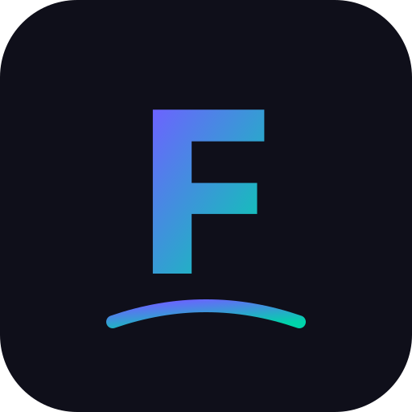

<p align="center">
  
</p>

<h1 align="center">FlowFit</h1>
<p align="center"><em>Il tuo flusso di allenamento</em></p>

<p align="center">
  
  
  
  
</p>

---

**FlowFit** è una Progressive Web App (PWA) per eseguire esercizi guidati con un'interfaccia **Spotify-style**. Gli esercizi sono definiti in semplici file Markdown — niente database, niente backend complesso. L'app traccia streak e progressi in locale, funziona offline e si installa come un'app nativa su qualsiasi dispositivo.

## ✨ Funzionalità

- **Player Spotify-style** — countdown di 5 secondi con beep ritmico, timer esercizio, timer di recupero
- **Suoni generati** — beep countdown con pitch crescente, chime di completamento, metronomo recovery (Web Audio API, zero file audio)
- **Streak & progressi** — dashboard con streak corrente/record, calendario attività (stile GitHub), lista ultimi completamenti
- **Dati in locale** — tutto salvato in LocalStorage, nessun login necessario
- **PWA installabile** — si installa come app nativa su mobile e desktop
- **Offline-ready** — Service Worker con caching intelligente
- **Mobile-first & responsive** — dark theme elegante, si adatta a smartphone, tablet e desktop
- **Esercizi via Markdown** — aggiungi nuovi esercizi creando semplici file `.md` con frontmatter YAML

## 🛠 Tech Stack

| Componente | Tecnologia |
|---|---|
| Backend | Python 3, Flask |
| Frontend | Vanilla JS, CSS custom properties |
| Suoni | Web Audio API (oscillatori, zero dipendenze) |
| Dati utente | LocalStorage (client-side) |
| PWA | Service Worker, Web App Manifest |
| Deploy | Azure Web App + Gunicorn |

## 📁 Struttura Progetto

```
training-app/
├── app.py                  # Flask app principale, API endpoints
├── config.py               # Configurazione (path esercizi)
├── exercises.py            # Parser Markdown + frontmatter
├── requirements.txt        # Dipendenze Python
├── startup.sh              # Script di avvio per Azure
├── exercises/              # ← I tuoi esercizi vanno qui
│   └── stretching-hips/    # Categoria = nome cartella
│       ├── 01-hip-flexor-stretch.md
│       └── 02-pigeon-pose.md
├── static/
│   ├── css/style.css       # Stili mobile-first, dark theme
│   ├── js/
│   │   ├── app.js          # SPA router e rendering pagine
│   │   ├── player.js       # Player con state machine
│   │   ├── sounds.js       # Generatore suoni Web Audio API
│   │   └── storage.js      # Persistenza locale (streak, completamenti)
│   ├── icons/              # Icone PWA (SVG + PNG)
│   ├── manifest.json       # Web App Manifest
│   └── sw.js               # Service Worker
└── templates/
    └── index.html          # Shell HTML della SPA
```

## 📝 Come Aggiungere Esercizi

Gli esercizi sono semplici file Markdown con un header YAML (frontmatter). Per aggiungere un nuovo esercizio:

### 1. Crea la cartella della categoria (se non esiste)

```bash
mkdir -p exercises/nome-categoria
```

Il nome della cartella diventa il nome della categoria (i trattini vengono convertiti in spazi e titolizzati).

### 2. Crea il file Markdown

Il nome del file determina l'ordine e lo slug: `NN-nome-esercizio.md` dove `NN` è un numero progressivo.

### 3. Formato del file

```markdown
---
title: "Nome Esercizio"
category: "Nome Categoria"
target: "Gruppo muscolare"
duration: 30
recovery: 15
difficulty: "beginner"
icon: "💪"
order: 1
---

Descrizione dell'esercizio.

## Istruzioni

1. Primo passo...
2. Secondo passo...

## Suggerimenti

- Suggerimento 1
- Suggerimento 2
```

### Campi frontmatter

| Campo | Tipo | Obbligatorio | Descrizione |
|---|---|---|---|
| `title` | string | ✅ | Nome dell'esercizio visualizzato nell'app |
| `category` | string | ❌ | Etichetta categoria (se diverso dal nome cartella) |
| `target` | string | ❌ | Gruppo muscolare target |
| `duration` | int | ✅ | Durata esercizio in **secondi** |
| `recovery` | int | ✅ | Tempo di recupero in **secondi** (0 = nessun recupero) |
| `difficulty` | string | ❌ | `beginner`, `intermediate`, o `advanced` (default: `beginner`) |
| `icon` | string | ❌ | Emoji visualizzata nella card (default: 💪) |
| `order` | int | ❌ | Ordine di visualizzazione nella categoria (default: 0) |

Il **corpo** del file Markdown (sotto il frontmatter) viene convertito in HTML e mostrato nella sezione "Istruzioni" del player.

## 🚀 Sviluppo Locale

### Prerequisiti

- Python 3.10+
- pip

### Installazione

```bash
# Clona il repository
git clone https://github.com/thedcfix/training-app.git
cd training-app

# Crea un virtual environment (opzionale ma consigliato)
python -m venv venv
source venv/bin/activate  # Linux/Mac
# oppure: venv\Scripts\activate  # Windows

# Installa le dipendenze
pip install -r requirements.txt
```

### Avvio

```bash
python app.py
```

L'app sarà disponibile su **http://localhost:5000**

## ☁️ Deploy su Azure Web App

### 1. Crea la Web App su Azure

```bash
az webapp create \
  --resource-group <RESOURCE_GROUP> \
  --plan <APP_SERVICE_PLAN> \
  --name <APP_NAME> \
  --runtime "PYTHON:3.11"
```

### 2. Configura il comando di avvio

```bash
az webapp config set \
  --resource-group <RESOURCE_GROUP> \
  --name <APP_NAME> \
  --startup-file "startup.sh"
```

### 3. Deploya il codice

```bash
az webapp up \
  --resource-group <RESOURCE_GROUP> \
  --name <APP_NAME>
```

In alternativa, configura il continuous deployment da GitHub nelle impostazioni della Web App nel portale Azure.

## 📱 Installazione come PWA

FlowFit è una Progressive Web App e può essere installata come app nativa:

- **Android (Chrome)**: apri l'app → menu ⋮ → "Aggiungi a schermata Home"
- **iOS (Safari)**: apri l'app → pulsante condividi → "Aggiungi a Home"
- **Desktop (Chrome/Edge)**: icona di installazione nella barra degli indirizzi

## 💾 Dati Locali

Tutti i dati dell'utente (completamenti, streak) sono salvati in **LocalStorage** nel browser. Non viene inviato nulla al server.

Struttura dei dati salvati:

```json
{
  "completions": [
    {
      "slug": "hip-flexor-stretch",
      "category": "stretching-hips",
      "title": "Hip Flexor Stretch",
      "icon": "🦵",
      "date": "2026-04-18",
      "timestamp": 1776672000000
    }
  ]
}
```

> ⚠️ Cancellando i dati del browser perderai lo storico dei completamenti e le streak.

---

<p align="center">Made with 💜 — <strong>FlowFit</strong></p>
